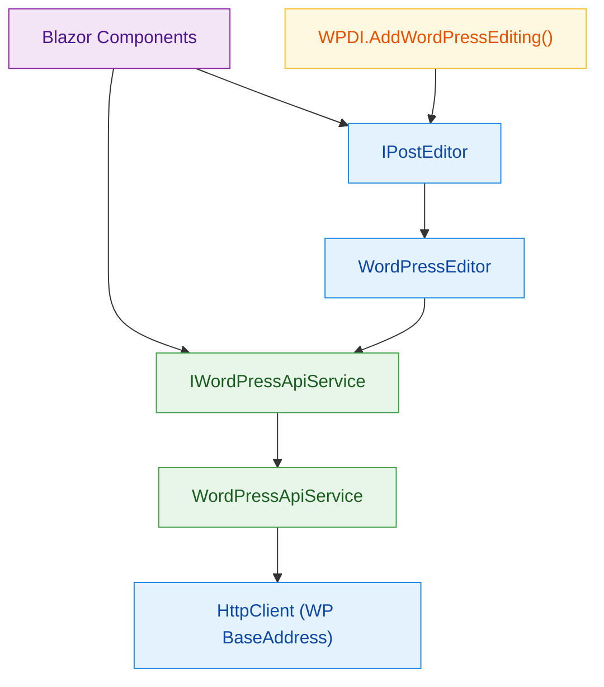
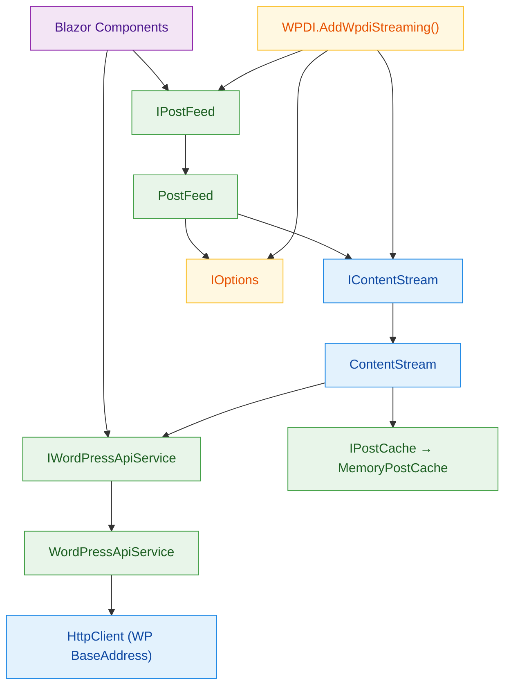

# BlazorWP – Dependency Injection Hierarchy

Here are two focused diagrams showing the DI wiring for **Editing** and **Streaming** services separately.

---

## Editing Services

---

## Streaming Services

---

### Notes
- **Editing**: centers on `IPostEditor` → `WordPressEditor` (**Scoped**), which is registered via `AddWordPressEditing`. That method wires `WordPressEditor` to consume the singleton `IWordPressApiService`:contentReference[oaicite:0]{index=0}. The service encapsulates the WP-configured `HttpClient` and auth options.
- **Streaming**: pivots on `IPostFeed` (**Singleton**) and `IContentStream` (**Scoped**), registered by `AddWpdiStreaming`. It also injects `IOptions<StreamOptions>` for configuration and an `IPostCache` (→ `MemoryPostCache`, **Singleton**) for caching:contentReference[oaicite:1]{index=1}.
- **WPDI role**: WPDI is the central extension layer that exposes `AddWordPressEditing` and `AddWpdiStreaming`. These ensure consumers only depend on abstractions (`IPostEditor`, `IPostFeed`, `IContentStream`) while the actual implementations (`WordPressEditor`, `PostFeed`, `ContentStream`) are consistently wired against `IWordPressApiService`. This provides a clean, testable DI surface, hides construction details, and enforces consistent HTTP/auth configuration:contentReference[oaicite:2]{index=2}.
- **Consistency**: both Editing and Streaming resolve all WordPress API calls through `IWordPressApiService`, ensuring a single source of truth for base URL, authentication, and lifetime.
