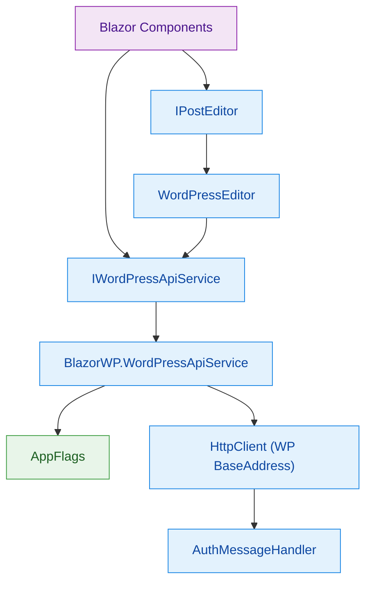
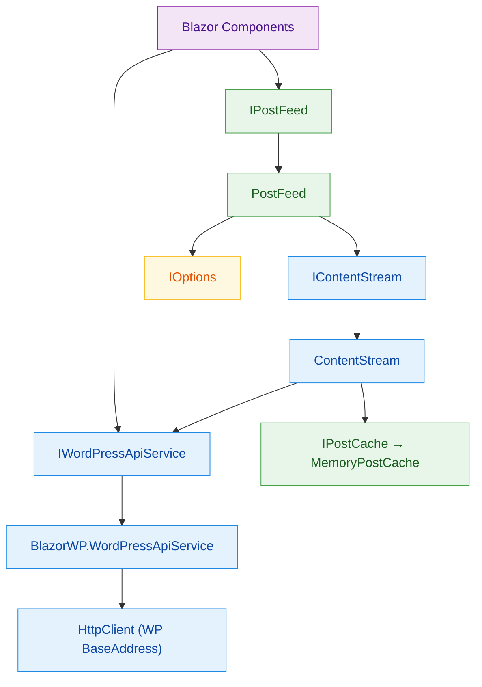

# BlazorWP – Dependency Injection Hierarchy

Here are two focused diagrams showing the DI wiring for **Editing** and **Streaming** services separately.

---

## Editing Services

---

## Streaming Services

---

### Notes
- Editing focuses on `IPostEditor` and `WordPressEditor` which rely on the WP-configured `HttpClient`.
- Streaming centers on `IContentStream` and `IPostFeed`, with caching via `MemoryPostCache` and configuration via `IOptions<StreamOptions>`.
- Both parts resolve their `HttpClient` through `IWordPressApiService`, ensuring consistent configuration and authentication.
